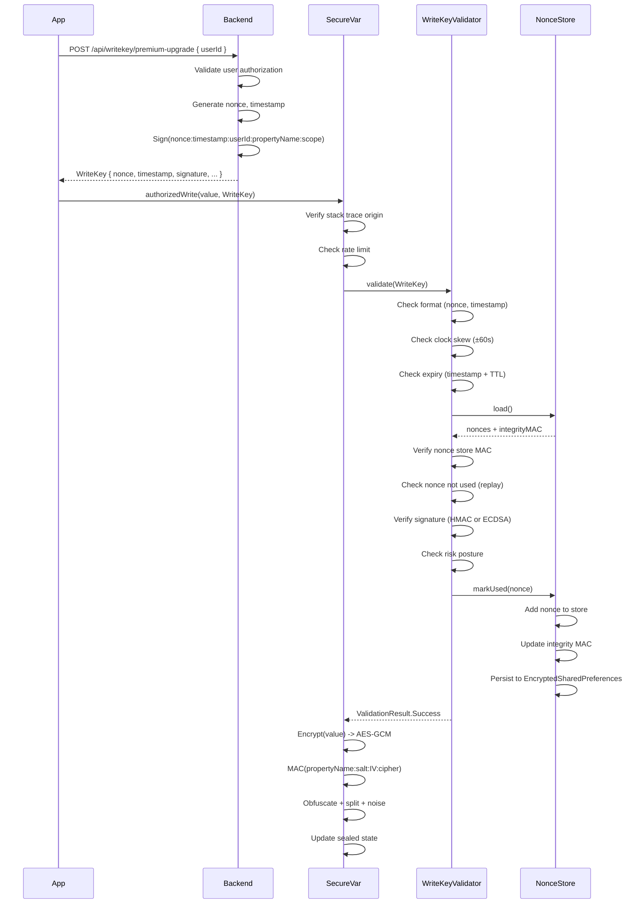
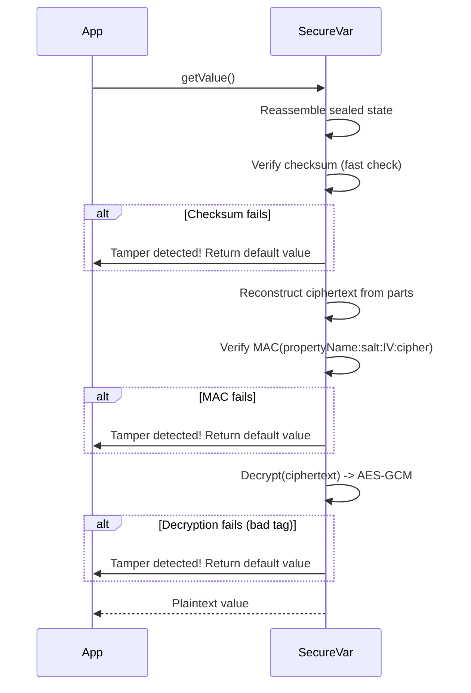

# Security Architecture

## Table of Contents

- [Overview](#overview)
- [Threat Model](#threat-model)
- [Cryptographic Design](#cryptographic-design)
- [Authorization Flow](#authorization-flow)
- [Attack Surface Analysis](#attack-surface-analysis)
- [Security Guarantees](#security-guarantees)
- [Recommendations](#recommendations)

## Overview

SecureVar implements a **defense-in-depth** security architecture with multiple independent layers. Each layer provides protection against different attack vectors, ensuring that compromise of one layer does not compromise the entire system.

### Design Principles

1. **Zero Trust**: Assume the client is compromised; validate everything
2. **Server Authority**: Only the backend can authorize variable modifications
3. **Cryptographic Integrity**: Use strong cryptography for all protection layers
4. **Time-Limited Access**: All authorizations expire automatically
5. **One-Time Use**: Prevent replay attacks via nonce tracking
6. **Observable Security**: Tamper attempts trigger alerts for monitoring

## Threat Model

### Assets

- **Secure Variables**: Application state that affects business logic (premium status, permissions, balances)
- **WriteKeys**: Server-issued authorization tokens for variable updates
- **Secrets**: MAC keys, encryption keys, nonce store
- **Nonce Store**: Replay prevention database

### Attackers

#### Level 1: Script Kiddie
**Capabilities**: Basic reverse engineering, memory inspection tools, known exploits  
**Goal**: Modify variables to gain unauthorized access (e.g., premium features)  
**Mitigations**: Encryption, MAC, obfuscation

#### Level 2: Skilled Attacker
**Capabilities**: Advanced reverse engineering, Frida/Xposed hooks, custom exploits  
**Goal**: Bypass protections, replay captured WriteKeys, forge signatures  
**Mitigations**: Asymmetric signatures, nonce tracking, origin verification, risk posture detection

#### Level 3: Nation-State Actor
**Capabilities**: Physical device access, hardware attacks, zero-days  
**Goal**: Extract secrets from AndroidKeyStore, forge WriteKeys  
**Mitigations**: Rate limiting (limits damage), server-side validation (defense-in-depth)

### Out of Scope

- **Server compromise**: If attacker controls backend, they can issue valid WriteKeys
- **OS vulnerabilities**: Zero-day exploits in Android itself
- **Social engineering**: Phishing users for credentials

## Cryptographic Design

### Layer 1: Server Authorization (WriteKey)

#### HMAC Signature (Default)

```
Message = nonce:timestamp:userId:propertyName:scope
Signature = HMAC-SHA256(secretKey, Message)
```

**Properties**:
- **Authenticity**: Only server with `secretKey` can generate valid signature
- **Integrity**: Any modification invalidates signature
- **Symmetric**: Same key for sign and verify (faster, but less secure)

#### ECDSA Signature (High-Risk Mode)

```
Message = nonce:timestamp:userId:propertyName:scope
Signature = ECDSA-Sign(privateKey, SHA-256(Message))
Verify = ECDSA-Verify(publicKey, SHA-256(Message), Signature)
```

**Properties**:
- **Public-key crypto**: Private key never leaves server
- **Non-repudiation**: Only server with private key can sign
- **High security**: Suitable for high-risk environments (debugger, root, emulator)

**Curve**: secp256r1 (NIST P-256)  
**Hash**: SHA-256  
**Signature format**: Base64-encoded DER

#### Signature Binding

Signatures bind multiple context fields to prevent **signature reuse**:

- `nonce`: Unique identifier (prevents replay)
- `timestamp`: Creation time (enforces TTL)
- `userId`: User identifier (prevents cross-user attacks)
- `propertyName`: Variable name (prevents cross-property attacks)
- `scope`: Operation scope (e.g., "premium_upgrade", "balance_update")

### Layer 2: Local Sealing (SecureVarDelegate)

#### AES-GCM Encryption

```
Key = SHA-256(encBaseSecret:propertyName:instanceSalt)[0:32]
IV = SecureRandom(12 bytes)
Ciphertext, Tag = AES-GCM-Encrypt(Key, IV, Plaintext)
```

**Properties**:
- **Confidentiality**: Plaintext value hidden from memory inspection
- **Authenticity**: 128-bit authentication tag prevents tampering
- **Unique keys**: Each delegate instance has unique key (instanceSalt prevents collision)

**Parameters**:
- **Algorithm**: AES-GCM (Galois/Counter Mode)
- **Key size**: 256 bits (derived from SHA-256)
- **IV size**: 96 bits (12 bytes, recommended for GCM)
- **Tag size**: 128 bits (maximum security)

#### HMAC-SHA256 MAC

```
Message = propertyName:instanceSalt:IV:Ciphertext
MAC = HMAC-SHA256(macSecret, Message)
```

**Properties**:
- **Redundant protection**: Independent of AES-GCM tag
- **Domain separation**: `propertyName:instanceSalt` prevents cross-instance MAC reuse
- **Constant-time verification**: Prevents timing attacks

#### Per-Instance Salt

```
instanceSalt = SecureRandom(16 bytes) | Base64-encode
```

**Purpose**:
- **Unique keys**: Two delegates with same `propertyName` get different AES keys
- **Prevents state injection**: Cannot transplant sealed state between delegates
- **No secrecy required**: Salt is public, provides domain separation only

#### Checksum (Fallback)

```
Checksum = (partA.hashCode() * 31 + partB.hashCode())
```

**Purpose**:
- **Fast detection**: Quick check before expensive MAC verification
- **Not cryptographic**: Simple hash for performance, not security
- **Obfuscation layer**: Combined with noise injection

### Layer 3: Replay Prevention

#### Nonce Store

**Storage**: EncryptedSharedPreferences (AndroidX Security Crypto)  
**Key**: `used_nonces`  
**Value**: JSON array of used nonces

**Operations**:
1. **Check**: Linear search for nonce in array
2. **Add**: Append nonce to array
3. **Cleanup**: Remove expired nonces when size exceeds threshold

#### Integrity MAC

```
CanonicalNonces = Sort(nonces).join(",")
IntegrityMAC = HMAC-SHA256(macSecret, CanonicalNonces)
```

**Purpose**:
- **Detect tampering**: User cannot remove nonces from store to enable replay
- **Stored alongside**: MAC saved in same SharedPreferences as nonces
- **Verified on load**: Every validation checks MAC before using nonce store

### Layer 4: Secret Management

#### Per-Install Secrets

**Generation**:
```kotlin
val bytes = ByteArray(32)
SecureRandom().nextBytes(bytes)
val secret = Base64.encodeToString(bytes, Base64.NO_WRAP)
```

**Storage**: EncryptedSharedPreferences
- **MasterKey**: AES256_GCM with AndroidKeyStore backing
- **Key encryption**: AES256_SIV (deterministic for key wrapping)
- **Value encryption**: AES256_GCM (authenticated)

**Secrets**:
- `mac_secret`: 32-byte random Base64 (for HMAC operations)
- `enc_secret`: 32-byte random Base64 (base secret for AES key derivation)

**Lifecycle**:
- **Generated once**: On first app launch
- **Persistent**: Stored until app uninstall
- **Per-install unique**: Each device has different secrets

## Authorization Flow

### Write Authorization Sequence



### Read Verification Sequence



## Attack Surface Analysis

### 1. Memory Inspection

**Attack**: Attacker dumps process memory to find plaintext values

**Defense**:
- ✅ **AES-GCM encryption**: Values stored encrypted in memory
- ✅ **Obfuscation**: Additional split + noise layer
- ⚠️ **Limitation**: Value briefly plaintext during read/write

**Residual Risk**: Low - brief exposure window, key remains separate

### 2. Direct Assignment

**Attack**: Attacker calls `variable.setValue(attackerValue)` directly

**Defense**:
- ✅ **setValue() disabled**: Triggers tamper alert, ignores write
- ✅ **Alert action**: Backend notified of attempt

**Residual Risk**: None - fully prevented

### 3. Replay Attack

**Attack**: Attacker captures valid WriteKey and replays it

**Defense**:
- ✅ **Nonce tracking**: Each nonce accepted once only
- ✅ **Persistent store**: Nonces survive app restarts
- ✅ **Integrity MAC**: Store tampering detected

**Residual Risk**: Low - requires store deletion (triggers fresh validation)

### 4. Tampering Sealed State

**Attack**: Attacker modifies `state` field directly via reflection/hook

**Defense**:
- ✅ **MAC verification**: Detects any modification
- ✅ **Checksum**: Fast pre-check before MAC
- ✅ **AES-GCM tag**: Authenticated encryption
- ✅ **Per-instance salt**: Prevents cross-delegate injection

**Residual Risk**: None - tampering detected on next read

### 5. Forging WriteKey

**Attack**: Attacker generates fake WriteKey without backend

**Defense**:
- ✅ **HMAC signature**: Requires `secretKey` (server-only)
- ✅ **ECDSA signature**: Requires private key (never on client)
- ✅ **Context binding**: Signature includes userId, propertyName, scope

**Residual Risk**: Low - cryptographically secure (256-bit keys)

### 6. Time Manipulation

**Attack**: Attacker modifies device clock to extend WriteKey lifetime

**Defense**:
- ✅ **Clock skew tolerance**: ±60 seconds (prevents false positives)
- ✅ **TTL enforcement**: WriteKeys expire after configured time
- ⚠️ **Limitation**: Local clock trusted within skew window

**Residual Risk**: Medium - attacker can gain up to TTL + 2*skew extension

### 7. Origin Spoofing

**Attack**: Attacker calls `authorizedWrite()` from unauthorized code

**Defense**:
- ✅ **Stack trace verification**: Checks call originated from allowed package
- ⚠️ **Limitation**: Advanced attackers may forge stack traces

**Residual Risk**: Medium - bypass requires runtime manipulation (Frida/Xposed)

### 8. Rate Abuse

**Attack**: Attacker floods authorized writes to cause issues

**Defense**:
- ✅ **Per-variable rate limiting**: Max writes per time window
- ✅ **Configurable**: Adjust limits per use case
- ✅ **Sliding window**: Uses timestamp queue for accurate counting

**Residual Risk**: Low - limits damage scope

### 9. Nonce Store Tampering

**Attack**: Attacker deletes nonces from SharedPreferences to enable replay

**Defense**:
- ✅ **Integrity MAC**: HMAC over canonical nonce list
- ✅ **Verified on load**: MAC checked before every validation
- ✅ **Encrypted storage**: EncryptedSharedPreferences prevents external modification

**Residual Risk**: Low - requires defeating EncryptedSharedPreferences

### 10. Cross-Instance State Injection

**Attack**: Attacker copies sealed state from one delegate to another with same propertyName

**Defense**:
- ✅ **Per-instance salt**: Each delegate has unique random salt
- ✅ **Salt in MAC**: `propertyName:instanceSalt:...` prevents cross-instance MAC match
- ✅ **Salt in key derivation**: Different AES keys per instance

**Residual Risk**: None - injection detected via MAC mismatch

## Security Guarantees

### Strong Guarantees

1. **Integrity**: Any modification to sealed state detected via MAC ✅
2. **Authenticity**: Only server with secret key can issue valid WriteKeys ✅
3. **Non-replay**: Each WriteKey accepted exactly once ✅
4. **Confidentiality**: Variable values encrypted in memory ✅
5. **Authorization**: Writes require valid server-issued WriteKey ✅
6. **Instance isolation**: Sealed states not transferable between delegates ✅
7. **Memory wiping**: Intermediate plaintext Strings zeroed via `SecureMemory` after read ✅

### Best-Effort Guarantees

1. **Origin enforcement**: Multi-signal verification via `OriginVerifier` (stack trace + ClassLoader + APK signature) ⚠️
2. **Time limits**: Device clock trusted within skew tolerance ⚠️
3. **Root detection**: Enhanced heuristics via `RiskDetector` (Magisk, KernelSU, mount namespaces, native libs) ⚠️
4. **Hook detection**: Frida/Xposed/Substrate scanning via `/proc/self/maps` and class loading ⚠️
5. **Plaintext wiping**: String backing arrays zeroed via reflection (JIT/GC may retain copies) ⚠️

### Non-Guarantees

1. **Server compromise**: If backend private key is compromised, attacker can issue valid WriteKeys ❌
2. **Physical access**: Attacker with physical device can extract KeyStore keys (device-dependent) ❌
3. **OS exploits**: Zero-day vulnerabilities in Android not protected against ❌

## Recommendations

### Deployment

1. **Use HTTPS**: Always transmit WriteKeys over TLS
2. **Certificate pinning**: Use `CertificatePinning` helper with backup pins for key rotation
3. **Short TTLs**: Use minimal TTL for WriteKeys (default: 5 minutes)
4. **Asymmetric signatures**: Enable ECDSA in production (stronger than HMAC)
5. **Alert monitoring**: Monitor tamper alerts for anomaly detection
6. **Rate limiting**: Tune limits based on expected usage patterns
7. **Origin verification**: Configure `OriginVerifier` with APK signature pins in production

### Key Management

1. **Rotate secrets**: Periodically regenerate `mac_secret` and `enc_secret`
2. **Separate keys**: Use different keys for MAC and encryption
3. **Backend key security**: Protect HMAC/ECDSA keys with HSM or KMS
4. **No hardcoded secrets**: All secrets provisioned at runtime
5. **Backup certificate pins**: Always include next certificate's pin for rotation

### Runtime Protection

1. **Risk callbacks**: Register `onRiskDetected` to handle compromised environments
2. **Origin verifier**: Use `OriginVerifier.Builder` with `pinSignature()` for APK integrity
3. **Secure scopes**: Use `SecureMemory.withSecureScope` for sensitive operations
4. **Debuggable check**: Ensure `FLAG_DEBUGGABLE` is not set in release builds

### Testing

1. **Penetration testing**: Regular security audits
2. **Fuzzing**: Test WriteKey validation with malformed inputs
3. **Tamper testing**: Verify detection of manual state modifications
4. **Replay testing**: Confirm nonces rejected on second use
5. **Risk detection testing**: Verify `RiskDetector.getDetailedRiskReport()` on various device profiles

### Monitoring

1. **Alert aggregation**: Collect tamper alerts in SIEM
2. **Anomaly detection**: Flag users with high tamper attempt rates
3. **Device fingerprinting**: Track suspicious device characteristics via `RiskReport`
4. **Backend correlation**: Cross-reference client tamper alerts with server logs

---

**Last Updated**: 2026-03-01  
**Version**: 2.0.0
